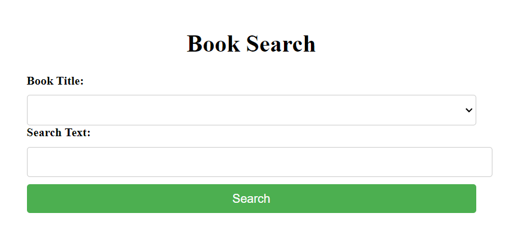

This project was generated with the help of ChatGPT, a large language model trained by OpenAI, based on the GPT-3.5 architecture. It was an experiment by the developer Avi to explore the capabilities of ChatGPT and to see how it can be used to build practical applications.

----
# Book Search API

This is a simple FastAPI app that allows users to search for a specific word or phrase in a book and returns the page(s) or chapter(s) where it was found. The app currently supports multiple books, and users can choose which book they want to search.

## Getting Started
### Prerequisites

Before running the app, you need to have Python 3.7 or later installed on your machine.

### Installing
To install the required Python packages, run:

```bash
pip install -r requirements.txt
```
### Running the app
To start the app, run the following command:

```bash
uvicorn main:app --reload
```
This will start the app on http://localhost:8000.

## User Interface
A user interface is available at `http://localhost:8000/` written in Vue by ChatGPT.


## API Documentation
To view the API documentation, go to http://localhost:8000/docs. This will open the Swagger UI where you can view the available endpoints and test them out.

## Usage
`GET /available_titles`

Request:

```bash
curl http://localhost:8000/available_titles
```
Response:

```json
[
  {
    "title": "Alice’s Adventures in Wonderland",
    "author": "Lewis Carroll",
    "key": "chapter"
  }
]
```

`POST /find_page`

Request:

```bash
curl -X 'POST' \
  'http://localhost:8000/find_page' \
  -H 'accept: application/json' \
  -H 'Content-Type: application/json' \
  -d '{
  "title": "Alice’s Adventures in Wonderland",
  "text": "very tired",
  "use_fuzz": false
}'
```
Response:

```bash
{
  "search_results": [
    "1",
    "2"
  ],
  "book": {
    "title": "Alice’s Adventures in Wonderland",
    "author": "Lewis Carroll",
    "key": "chapter"
  }
}
```